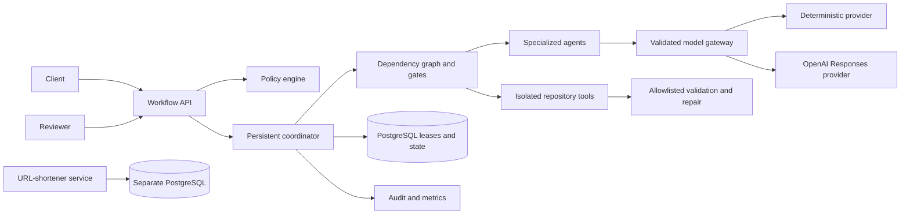

# Architecture

## Purpose

The platform turns a software requirement into a versioned, reviewable engineering workflow. Agents operate inside policy boundaries; authenticated people approve the change design and final release. The URL shortener is both a working service and the assessment target.

## Components

The explicit graph covers requirement understanding, ambiguity detection, repository analysis, decomposition, architecture, parallel implementation and test work, patch policy, application, validation, bounded repair, documentation, risk review, and release readiness. Dependencies synchronize parallel paths. Entry and exit gates stop work for clarification, change approval, and release approval.

## State and governance

Workflow runs, revisions, task checkpoints, policies, approvals, artifacts, and audit events persist in PostgreSQL. A clarification creates a new revision; the impact planner invalidates affected downstream work and marks unaffected outputs reusable. Approvals bind to the current revision and a canonical hash of the reviewer-supplied artifact set. A later revision invalidates prior approvals.

Each task claim uses a pessimistically locked database row, a unique instance owner, an expiry, and a monotonically increasing fencing token. Heartbeats extend live work. A stale worker cannot complete a task after another instance reclaims it. Every instance scans `RUNNING` workflows at startup and periodically; expired tasks return to `READY` and execution resumes from persisted task and scenario inputs. Clarification and approval states remain paused because they require human input rather than recovery.

Repository access is constrained to an approved root. Work occurs in revision-specific copies with immutable baseline manifests. Patch operations reject traversal, symbolic links, absolute paths, protected build configuration, stale file hashes, duplicate paths, excessive output, and unsupported file types. Validation executes a fixed Maven capability through an operator-selected executable, strips model credentials from the child environment, bounds output and time, and rolls back failed or cancelled work.

## Model boundary

All agents use structured requests and JSON-schema-validated responses. Deterministic mode is the default and requires no credential; it provides repeatable CI and reviewer behavior. Setting `AGENTIC_SDLC_LLM_PROVIDER=openai` and `OPENAI_API_KEY` selects the real Responses API provider without changing agent contracts. Credentials remain environment-only and audit payloads redact secret-like values.

## Reliability and observability

Actuator publishes health probes and Prometheus metrics. Domain meters report submitted workflows, terminal outcomes, task outcomes, retries, repairs, repair duration, rollbacks, and end-to-end duration. Correlation IDs cross the HTTP, audit, and workflow records. Audit rows hash the original payload while persisting a redacted representation.

## Trust boundaries and limitations

- Local mode uses environment-configured Basic users for deterministic evaluation. Production mode validates OIDC JWT issuer, audience, time bounds, and signature, then maps identity-provider roles into platform authorization. TLS and config-tree secret mounts are supported by both services.
- Active Java threads are process-local, while ownership and progress are database-backed. Recovery occurs after lease expiry, so failover latency is bounded by the configured lease and recovery intervals.
- Every API-submitted catalog scenario invokes the provider-neutral agents, creates an idempotent requirement-linked source and test mutation in its isolated revision workspace, persists its manifest and bounded diff, and runs the workspace Maven Wrapper. The brownfield repair scenario records a real compiler failure, supplies bounded output to the repair agent, applies the corrected patch, and reruns validation. The reusable `LifecycleExecution` also supports fully model-proposed patch operations through the same governed tool boundaries.
- The URL service stores one redirect event per request for audit-friendly daily analytics. High-volume production use should batch or stream events and use partitioned aggregates.
- URL controls include region-namespaced allocation, private-target and deny-list rejection, per-instance rate limiting, and scheduled retention. Production ingress and egress policy remain necessary for global edge limits and DNS-rebinding protection.
